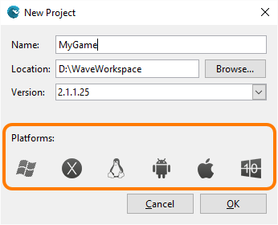
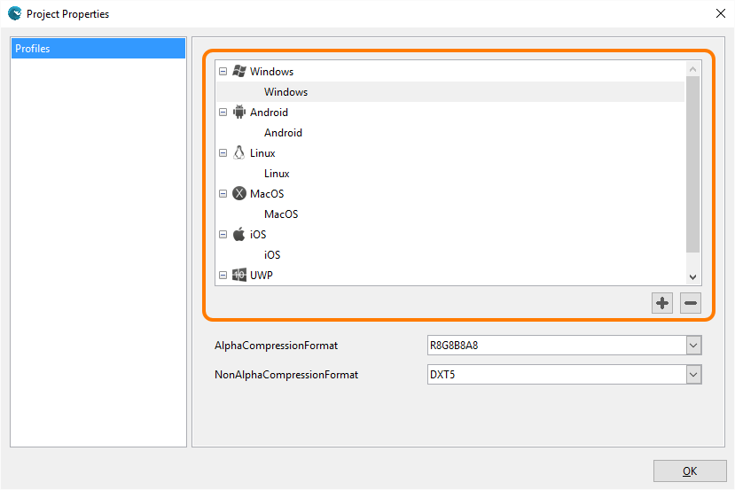

## Goal

Within this recipe you will learn how to port your games to every platform Wave Engine supports, creating profiles for: Windows (desktop), Mac OS X, Linux, iOS, Android, and/or Windows 10 (Universal Windows Platform) platforms.

## Hands-on

> [!Note]
> Managing profiles cannot be done from the IDE, but through Wave Visual Editor.

### With Wave Visual Editor

One of the first things you are asked for when creating a new project is which profiles (and platforms) it will target.

However, if you already created your game and want to add a new profile later, it can be done at Edit menu, Project Properties and Profiles.

When you add a new target profile, a new launcher project is added to Launchers directory. For example, if you select Linux, Mac OS, and Windows profiles, it will create the following ones: Linux, MacOS and Windows, everything beneath Launchers. At the same time, a new .sln file is added at the root project folder, with the pattern ProjectName_ProfileName.sln.

At this point, you can use your favorite C# IDE, in the final phase, to build your game to mobile platforms, without any problem or incompatibility.

## Wrap-up

You have learned how to select target profiles for your game. You have also been guided through how physically this happens within the solution hierarchy.