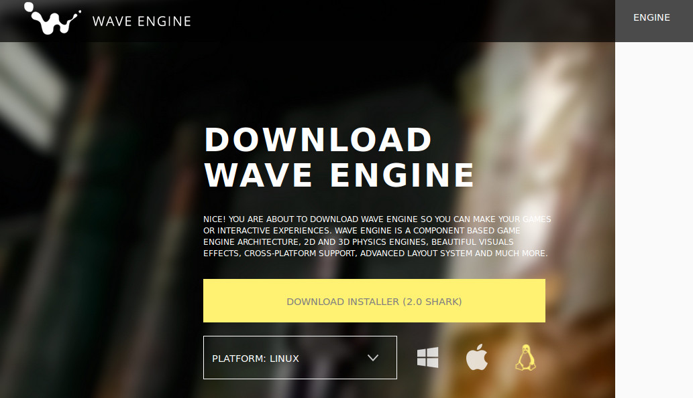
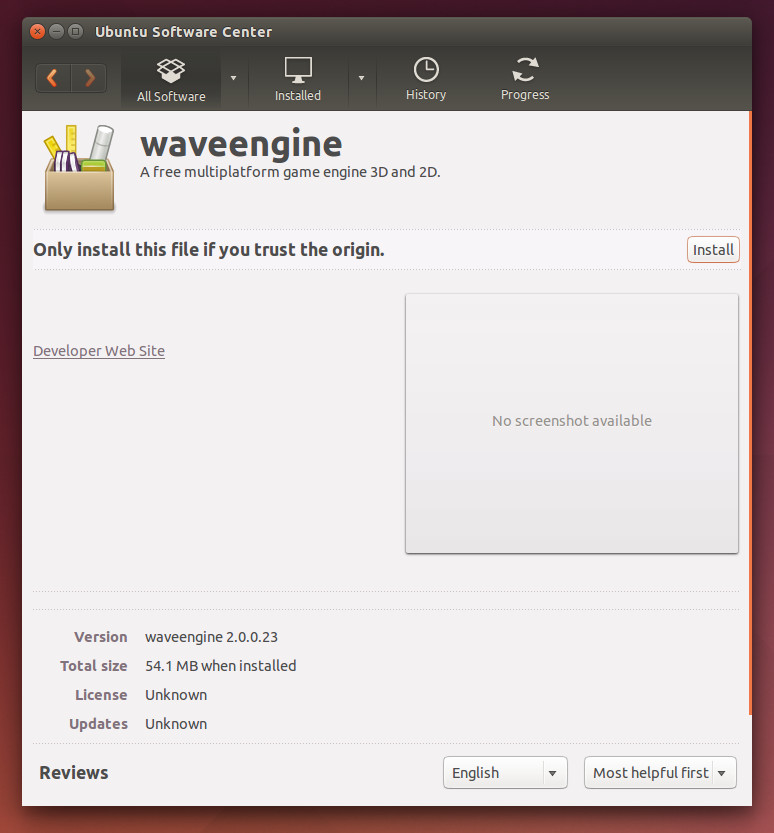
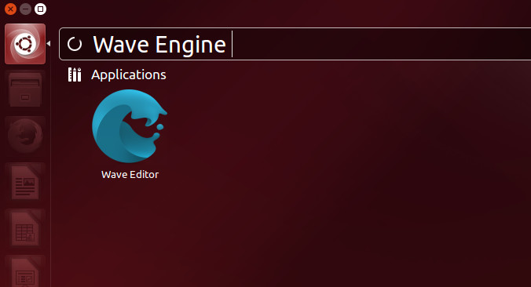

# Quick Start Video

Getting Started with Wave Engine on Linux (Ubuntu):

# Prerequisites

## Mono

You need to install [Mono](http://www.mono-project.com/download/#download-lin) 5.2 or higher to develop with WaveEngine. Follow the instructions from the official page.

## Other dependecies
    sudo apt-get install gtk-sharp2 sox libsdl2-mixer-2.0.0

## IDE

### Installing MonoDevelop

You need to install [MonoDevelop](http://monodevelop.com/) 6.0 or higher to develop with Wave Engine.
Most Linux distributions include an earlier version of MonoDevelop, so you need to install it from the Mono official package repository.

Follow the instructions given in the official MonoDevelop page: [Install MonoDevelop on Linux](http://www.monodevelop.com/download/linux/)

#### Warning
    The use of Flatpak to execute MonoDevelop comes with some caveats produced by the sandbox where it runs, they will be specified in the FAQ that you can found at the bottom of this page.

    To enjoy a full experience while developing with Wave Engine, we recomends you to use MonoDevelop without Flatpak, this can be achieved building MonoDevelop from sources at [GitHub](https://github.com/mono/monodevelop).

    Here you have some useful links that can help you to run MonoDevelop without Flatpak:
    - https://github.com/mono/monodevelop#compiling
    - https://kvssoft.wordpress.com/2016/12/13/building-monodevelop-on-ubuntu/

    We are working to improve the experience using MonoDevelop with Flatpak to develop with WaveEngine.

### Launching MonoDevelop

To open MonoDevelop using Flatpak, please execute the following command on a console:

    $ flatpak run com.xamarin.MonoDevelop --filesystem=host

The parameter '--filesystem=host' is given to avoid issues when WaveEngine exports assets.

It is recommended to create a shortcut anywhere on the desktop to access it more easily. Please refer to your corresponding Window Manager to gather how it is done.

# Install Wave Engine

Visit the official [Wave Engine](https://waveengine.net/) web-site, click on Download Wave Engine button (it will redirect to the [Download](http://waveengine.net/Downloads) page) and finally Download Installer one. Please assure the platform below is Linux.

Double click on it if you are on Ubuntu, and a friendly setup process will handle the installation. If you are running a different Linux distribution, please refer to the on-line documentation on how to proceed with a .deb file.

Finally, after the installation ends, you will find Wave Editor application right there on the list:

# Create a Wave Engine Account

The first time you open Wave Visual Editor you will be asked for an user account.

[Create a Wave Engine Account](Create-Account.md).

# Your First Application

Please, navigate to [My First Application](My-First-Application.md).

# FAQ

 - **Q: How install Mono in Ubuntu 17.04 or 17.10?**
 - **A:** Install it following the steps indicated for Ubuntu 16.04.

 - **Q: When I build my project from MonoDevelop, the proccess fails while exporting sound files.**
 - **A:** This is a known issue launching the project from MonoDevelop installed using Flatpak. The exporter uses tools that is not included in the Flatpak sandbox. A workaround is to run the project using WaveEngine Editor first, this proccess exports the sound files that will be used by MonoDevelop the nexts times you build the project.

 - **Q: When I run my project from MonoDevelop, the MusicPlayer service throws an exception when the Pay method is called.**
 - **A:** This is a known issue launching the project from MonoDevelop installed using Flatpak. You can execute your application from the terminal or use MonoDevelop build from sources.

 - **Q: When I run my project from MonoDevelop, the mouse is not recognized.**
 - **A:** This is a known issue launching the project from MonoDevelop installed using Flatpak. You can execute your application from the terminal or use MonoDevelop build from sources.

 - **Q: When I click in "File -> Open C# Solution..." of WaveEngine Editor menu, MonoDevelop is not opened.**
 - **A:** This is a known issue runing the project from WaveEngine Editor with MonoDevelop installed using Flatpak. You open MonoDevelop and open the sln file in the project folder. Also, depending of your launcher you can associate the '.sln' file extension to launch MonoDevelop.

_If you find any question which may fit here, please [contact us](https://waveengine.net/Company#Contact)._