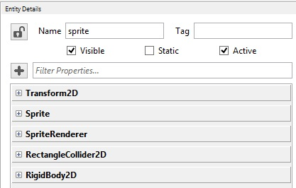
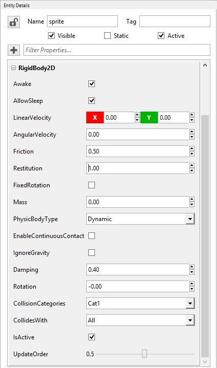

## Goal

Nowadays adding physic behaviours to our games is as immediate as adding a few lines of code. Wave Engine wraps low level physic components leveraging a simple API which follows the guidelines found all over the engine: component-based architecture, specific renderer for each drawable component, etc.

On the following paragraphs we will learn how to add a rigid body physic capability to an entity, acting according to the world gravity.

## Hands-on

Converting an entity into a physic object is particularly easy with Wave Engine. There are multiple forms of physic objects available, but here we will cover the most basic one: `RigidBody2D`. It can be found under `WaveEngine.Framework.Physics2D` namespace, where the rest of physic capabilities are collected.

Wave Engine's 2D physics are based on [Farseer Physics Engine](https://farseerphysics.codeplex.com/) which, at the same time, is based on [Box2D](http://box2d.org/); so, there is a relationship between what this last one offers for a 2D rigid body and what Wave Engines does. The most popular properties which allow to configure the physic behaviour for this element are (the summary is taken from Box2D's official documentation found [here](http://box2d.org/manual.pdf)):
 * Damping: _is used to reduce the world velocity of bodies. Damping is different than friction because friction only occurs with contact. Damping is not a replacement for friction and the two effects should be used together. Damping parameters should be between 0 and infinity, with 0 meaning no damping, and infinity meaning full damping_
 * Friction: _is used to make objects slide along each other realistically. [...] The friction parameter is usually set between 0 and 1, but can be any non-negative value. A friction value of 0 turns off friction and a value of 1 makes the friction strong_
 * Restitution: _is used to make objects bounce. The restitution value is usually set to be between 0 and 1. Consider dropping a ball on a table. A value of zero means the ball won't bounce. This is called an inelastic collision. A value of one means the ball's velocity will be exactly reflected. This is called a perfectly elastic collision_
 * Rotation: expressed in radians, allow the entity to rotate during the physics computation happens

### With Wave Visual Editor

You can see [Load a Sprite recipe](Load-a-Sprite-(Image).md) from this web as starting point.

Select the Sprite Entity and use the  icon from Entity Details section to add a RectangleCollider2D and RigidBody2D Components (in that order cause RigidBody requires a Collider):



Set the physic properties from Cube Entity's RigidBody3D:



And let them fall!

### With Visual Studio/Xamarin Studio

We'll use the [Load a Sprite recipe](Load-a-Sprite-(Image).md) from this web as starting point.

Select ``Open C# Project`` option from ``File`` menu.

In Visual Studio we'll open the scene file and add the code (in CreateScene method):

```c#
var entity = this.EntityManager.Find("sprite");

entity.AddComponent(new RectangleCollider2D())
	.AddComponent(new RigidBody2D()
	{
		AllowSleep = true,
		LinearVelocity = Vector2.Zero,
		AngularVelocity = 0.0f,
		Friction = 1.0f,
		Restitution = 1.0f,
		FixedRotation = false,
		Mass = 1.0f,
		EnableContinuousContact = false,
		IgnoreGravity = false,
		Damping = 0.4f,
		Rotation = 0.0f,
		CollisionCategories = Physic2DCategory.Cat1,
		CollidesWith = Physic2DCategory.All
	});
```

The resulting executing will show a falling sprite by gravity.

## Wrap-up

We have introduced the `RigidBody2D` component, and some of the most used properties. Finally, we have created an `Sprite Entity` with this which behaves like a physic object.