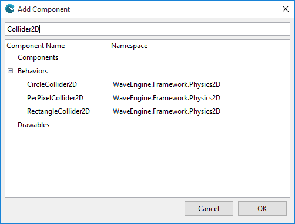

## Goal

To know when two different entities collide between them is posible through these `Collider2D` components (colliders are available also on 3D). Within this recipe we will see how to know when an `Entity` intersects with another one.

## Hands-on

`WaveEngine.Framework.Physics3D.Collider2D` is the base abstract class for the following built-in colliders:
* CircleCollider2D
* PerPixelCollider2D
* RectangleCollider2D

Every `Collider2D` requires a `Transform2D` `Component` on the `Entity`, which handles the position in the 2D world, among other things.

### With Wave Visual Editor

Using Wave Visual Editor we can add the RectangleCollider2D behavior using the add component button in the `Entity Details` panel.



### With Visual Studio/Xamarin Studio

The `Entity` would be built in the following way:

```c#
var sprite = new Entity("Sprite") 
	.AddComponent(new Sprite("Content/Texture.wpk")) 
	.AddComponent(new SpriteRenderer(DefaultLayers.Alpha)) 
	.AddComponent(new RectangleCollider2D()) 
	.AddComponent(new Transform2D()); 
```

Later on, we can call `Collider2D.Intersects()` to check whether the collision happens:

```c#
var collider = sprite.FindComponent<RectangleCollider2D>();

// anotherCollider must be previously added to a different Entity
if (collider.Intersects(anotherCollider))
	Debug.WriteLine("The entities collide");
```

## Wrap-up

After seeing the different `Collider2D` which Wave Engine includes, we have gone through how quickly check whether two entities collide between them.