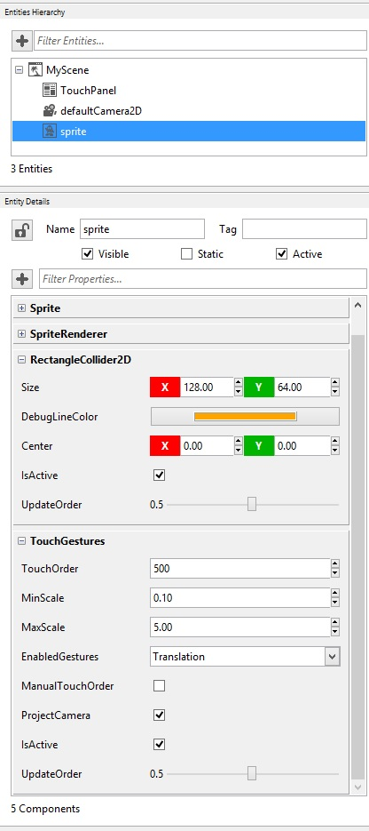
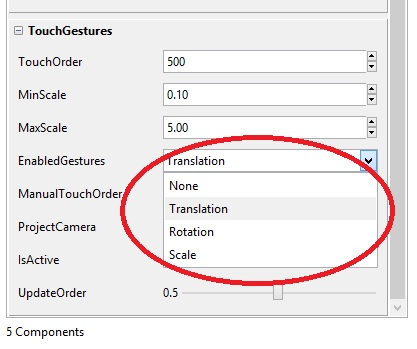

## Goal

Within this recipe you will learn how to use touch capabilities in all platforms with the TouchGestures component which will allow you to move, rotate and scale an entity

## Hands-on

### With Wave Visual Editor

Given you already have a sprite on your project, you will need to add both a _Collider_ and a _TouchGestures_ components:



If you modify the EnabledGestures property from _TouchGesture_ component you can use the different gestures soported:



### With Visual Studio/Xamarin Studio

In your favorite code editor you can add both _Collider_ and _TouchGestures_ components with the code:

```C#
sprite.AddComponent(new RectangleCollider2D())
      .AddComponent(new TouchGestures() 
                    { 
                        EnabledGestures = SupportedGesture.Translation
                    });
```
`TouchGestures` component offers some events that can be useful in a lot of scenarios:

* `TouchMoved`

    Occurs when there is a moved gesture.

* `TouchOrderChanged`

    Occurs when touch order is changed.

* `TouchPressed`

    Occurs when there is a pressed gesture.

* `TouchReleased`
    
    Occurs when there is a released gesture.

* `TouchTap`

    Occurs when there is a tap gesture

## Wrap-up

You have learned how you can use touch and gesture capabilities in all platforms with **Wave Engine**