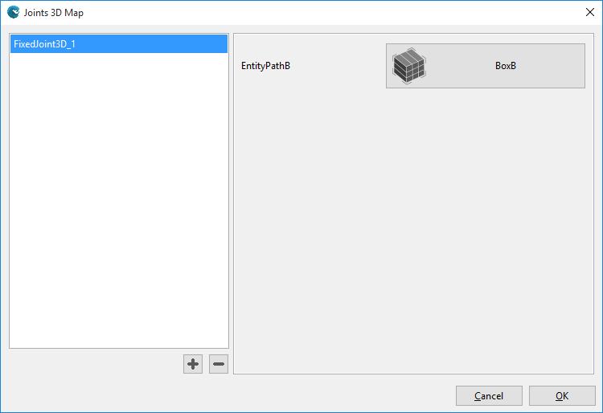

## Goal

A joint in physics is a relationship between two different objects. Such is a base behaviour when working with physics, and [Wave Engine](http://waveengine.net) supports multiple types of 3D joints.

This recipe will briefly summarise all of the available 3D joints, showing how are handled in code in general aspects.

## Hands-on

Every 3D joint inherits from abstract class [WaveEngine.Framework.Physics3D.Joint3D](xref:WaveEngine.Framework.Physics3D.Joint3D). Wave Engine supplies currently the following implementations:
 - [FixedJoint3D](xref:WaveEngine.Framework.Physics3D.FixedJoint3D): restricts one angular degree of freedom. Each entity has an axis attached and the constraint attempts to prevent any relative twisting motion around the axes.
 - [HingeJoint3D](xref:WaveEngine.Framework.Physics3D.HingeJoint3D): allows one angular degree of freedom between two entities. It is composed of a "Ball Socket" joint and a "Revolute Angular" one. Hinge Joints are commonly used for door hinges, elbows, and axis joints. 
 - [LineSliderJoint3D](xref:WaveEngine.Framework.Physics3D.LineSliderJoint3D): is created from a "Point on Line" joint and a "Revolute Angular" one. This leaves the entities with both one linear sliding and one angular degrees of freedom.
 - [PlaneSliderJoint3D](xref:WaveEngine.Framework.Physics3D.PlaneSliderJoint3D): restricts a single linear degree of freedom. It is created from a "Point on Plane" joint, and a "Linear Axis Limit" and "Linear Axis Motor" for each of two axes on the plane.
 - [PrismaticJoint3D](xref:WaveEngine.Framework.Physics3D.PrismaticJoint3D): allows both a single sliding linear and zero angular degrees of freedom between two entities.
 - [SwivelHingeJoint3D](xref:WaveEngine.Framework.Physics3D.SwivelHingeJoint3D): allows two angular degrees of freedom between two entities. It is comprised of a "Ball Socket" and a "Swivel Hinge Angular" joints. The joint also provides control over the free degrees of freedom through its properties, which is initially inactive. 
 - [UniversalJoint3D](xref:WaveEngine.Framework.Physics3D.UniversalJoint3D): allows two angular degrees of freedom between two entities. It is comprised of a "Ball Socket" and a "Twist" joints. It is useful for transferring twist motion around angles, such as in vehicle drive shafts.

### With Wave Visual Editor

In order to demo how a 3D joint can be added within Wave Visual Editor, we will focus on `FixedJoint3D` one, although the same steps apply to other ones from above list. Also, we will start with an existing sample: [FixedJoint](https://github.com/WaveEngine/Samples/tree/master/Physics3D/FixedJoint) one, where two boxes are joined through a `FixedJoint`.

In the scene where we have the two box entities, select the one on top and add a [JointMap3D](xref:WaveEngine.Framework.Physics3D.JointMap3D) component, using the Add component button in the Entity Details panel. In the properties list you will find a new one called Joints. Using the Dictionary button when can create and add new ones, selecting the joint type and the connected entity:



### With Visual Studio/Xamarin Studio

To recreate the previous sample using code, it is supposed we have already created the two boxes. Finally, simply add a `JointMap3D` component to one of them, establishing a link/join with the other:

```c#
var boxA = CreateBoxA(); // This method returns the boxA entity
var boxB = CreateBoxB(); // This method returns the boxB entity

boxA.AddComponent(new JointMap3D()
	.AddJoint(“Joint”, new FixedJoint(boxB)));
```

## Wrap-up

This recipe has showed us which are the available [Joint3D](xref:WaveEngine.Framework.Physics3D.Joint3D) in Wave Engine, how those are briefly used and, more specifically, how the `FixedJoint` works on one of our samples.