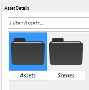
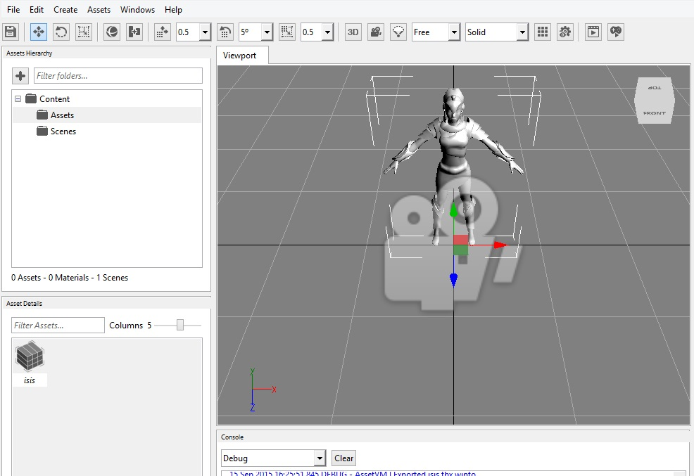

## Goal

A common 3D game uses to have models (3D also) created by designers/modellers on software like [3DS Max](http://www.autodesk.es/products/3ds-max/overview) or [Blender](https://www.blender.org/). Models are exported in known formats so can be read from game engines. One of those formats is [FBX](https://en.wikipedia.org/wiki/FBX), an standard within games industry.

In the following paragraphs, you will learn to load an .fbx model and add it into an scene.

## Hands-on

### With Wave Visual Editor

Create a new project with Wave Visual Editor. On the Asset Details panel, double click on Assets folder:



Right click on its empty space and select Import Asset. We will add [isis.fbx](https://github.com/WaveEngine/Samples/blob/master/Graphics3D/IsisTemple/Content/Assets/Models/isis.fbx) file, which is part of the [IsisTemple sample](https://github.com/WaveEngine/Samples/tree/master/Graphics3D/IsisTemple/Content/Assets/Models).

Once Wave Visual Editor has loaded the model, simply drag and drop the item into the Viewport:



### With Visual Studio/Xamarin Studio

Open the project from Visual Studio or Xamarin Studio, and rebuild the solution just to update `WaveContent.cs` -a helper to easily reference the paths to the assets you have added in Wave Visual Editor.

There are a few pieces -components actually- needed to handle an .fbx model (appart from those needed to place an entity in a 3D world):
* [SkinnedModel](xref:WaveEngine.Components.Graphics3D.SkinnedModel): in charge of loading the .fbx file, also reads the animations such file has.
* [SkinnedModelRenderer](xref:WaveEngine.Components.Graphics3D.SkinnedModelRenderer): makes the final render.
* [Animation3D](xref:WaveEngine.Components.Animation.Animation3D): since our model is "skinned", it implies we want to handle its animations to trigger those in any moment of the game. This functionality is specifically covered [here](Play-an-Animated-FBX-Model.md).

Modify your `Scene.CreateScene()` method in this way (notice how `isis.fbx` is referenced through `WaveContent`):
```C#
protected override void CreateScene()
{
    this.Load(WaveContent.Scenes.MyScene);

    var isis = new Entity()
        .AddComponent(new Transform3D())
        .AddComponent(new MaterialsMap())
        .AddComponent(new SkinnedModel(WaveContent.Assets.isis_fbx))
        .AddComponent(new Animation3D())
        .AddComponent(new SkinnedModelRenderer());

    this.EntityManager.Add(isis);
}
```

In the end, we are adding the same entity hierarchy Wave Visual Editor creates when we drag and drop the model to the scene:

![] (images/LoadModelFromFile/EntityDetails.jpg)

## Wrap-up

This recipe has guided us through what is an FBX file and how it can be loaded into Wave Engine, both visually and through source code.