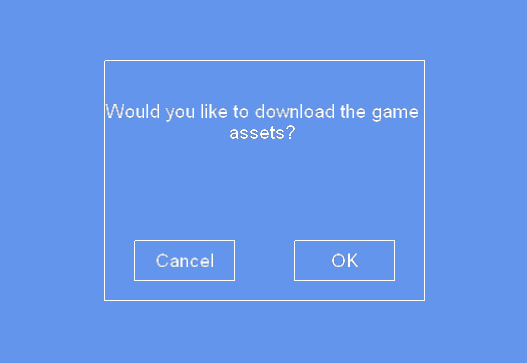

## Goal

It is a common pattern to begin a game though a menu: new game, load game, options, etc. Such elements are built by composition of UI controls, like buttons and labels. Wave Engine ships with a list of [predefined controls](xref:Wave​Engine.​Components.​UI), along with layer types, which can solve multiple situations in your games.

However, what happens if you need an specific UI element which does not exist? This recipe gives a quick hint to cover this question, providing a simple pattern to build a typical alert box, with accept and cancel buttons.

## Hands-on

### With Wave Visual Editor

This recipe cannot be done just by using the Editor, although it is needed to create the initial project, and choose the 2D camera (UIs work in 2D mode), by cliking on the 3D toggle button from the icons bar. You will notice it switches to 2D, and the Viewport follows accordingly by switching to the default 2D camera.

In order to continue, please keep reading below section.

### With Visual Studio/Xamarin Studio

Once the project is correctly set-up following above instructions, open the C# solution through the File menu.

Our alert control will be added like any other `Entity`, and will have a `Show()` method with the following signature:

```c#
void Show(string message, Action okAction, Action cancelAction)
```

, where 'message' will be the alert's title, and the two following `Action` the specific logic to execute upon clicking on accept and cancel buttons, respectively.

The `Alert` control will inherit [Grid](xref:Wave​Engine.​Components.​UI.Grid), as it fits perfectly to align the internal controls: a [TextBlock](xref:Wave​Engine.​Components.​UI.TextBlock), and two [Button](xref:Wave​Engine.​Components.​UI.Button). The firts step it to configure such `Grid` to handle such:

```c#
public class Alert : Grid
{
	public Alert()
		: base()
	{
		this.SetUpGrid();
		
		[…]

		this.IsVisible = false;
	}
	
	[…]
```

By default, the control will be hidden upon creating it, and `Show()` will "wake" it up on demand when needed.

```c#
private void SetUpGrid()
{
	this.Width = 320;
	this.Height = 240;

	this.IsBorder = true;

	this.HorizontalAlignment = HorizontalAlignment.Center;
	this.VerticalAlignment = VerticalAlignment.Center;

	this.RowDefinitions.Add(new RowDefinition() { Height = new GridLength(2, GridUnitType.Proportional) });
	this.RowDefinitions.Add(new RowDefinition() { Height = new GridLength(1, GridUnitType.Proportional) });
	this.ColumnDefinitions.Add(new ColumnDefinition() { Width = new GridLength(1, GridUnitType.Proportional) });
	this.ColumnDefinitions.Add(new ColumnDefinition() { Width = new GridLength(1, GridUnitType.Proportional) });
}
```

As it can be appreciated, the latest lines configure the `Grid` rows and columns, which will later allow us to place the rest of controls:

```c#
private void CreateHeader()
{
	this.headerTextBlock = new TextBlock
	{
		Width = this.Width,
		Height = this.Height / 3,
		Text = "Lorem ipsum dolor sit amet, consectetur adipiscing elit, sed do eiusmod tempor incididunt ut labore et dolore magna aliqua.",
		TextWrapping = true,
		TextAlignment = TextAlignment.Center,
		VerticalAlignment = VerticalAlignment.Center
	};

	this.headerTextBlock.SetValue(GridControl.RowProperty, 0);
	this.headerTextBlock.SetValue(GridControl.ColumnProperty, 0);
	this.headerTextBlock.SetValue(GridControl.ColumnSpanProperty, 2);

	this.Add(this.headerTextBlock);
}
```

`CreateHeader()` must be called within `Alert` ctor. In the same way, the other two buttons:

```c#
private void CreateCancelButton()
{
	var cancelButton = new Button()
	{
		Text = "Cancel",
		HorizontalAlignment = HorizontalAlignment.Center,
		VerticalAlignment = VerticalAlignment.Center
	};

	cancelButton.Click += (sender, args) =>
	{
		this.IsVisible = false;

		if (this.cancelAction != null)
		{
			this.cancelAction();
		}
	};

	cancelButton.SetValue(GridControl.RowProperty, 1);
	cancelButton.SetValue(GridControl.ColumnProperty, 0);

	this.Add(cancelButton);
}

private void CreateOKButton()
{
	var okButton = new Button
	{
		Text = "OK",
		HorizontalAlignment = HorizontalAlignment.Center,
		VerticalAlignment = VerticalAlignment.Center
	};

	okButton.Click += (sender, args) =>
	{
		this.IsVisible = false;

		if (this.okAction != null)
		{
			this.okAction();
		}
	};

	okButton.SetValue(GridControl.RowProperty, 1);
	okButton.SetValue(GridControl.ColumnProperty, 1);

	this.Add(okButton);
}
```

The code is almost the same on both cases, but are placed on different spaces within the main `Grid`.

Finally, `Show()` will make the control visible again, triggering the specific `Action` when the user interacts with it:

```c#
public void Show(string message, Action okAction, Action cancelAction)
{
	this.headerTextBlock.Text = message;

	this.okAction = okAction;
	this.cancelAction = cancelAction;

	this.IsVisible = true;
}
```

Within a sample use scenario, this would be the final result:

```c#
protected override void CreateScene()
{
	this.Load(WaveContent.Scenes.MyScene);

	this.alert = new Alert();
	this.EntityManager.Add(this.alert);
}

protected override void Start()
{
	base.Start();

	this.alert.Show("Would you like to download the game assets?",
		() => Debug.WriteLine("Yes"),
		() => Debug.WriteLine("No"));
}
```



## Wrap-up

You have learned how to extend the existing UI, through composition, to build a new alert control.